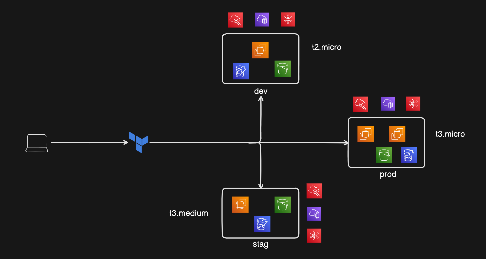

# Terraform AWS Multi-Environment Infrastructure

## Project Overview

This project provisions a **multi-environment AWS infrastructure** using **Terraform modules**.  
It supports **dev**, **staging (stag)**, and **production (prod)** environments with environment-specific configurations such as instance type, instance count, and storage size.

The infrastructure follows **Terraform and DevOps best practices**:
- Modular architecture
- Reusable infrastructure code
- Environment-based configuration
- Clean and scalable design

---

## Architecture Diagram

The following diagram represents the infrastructure created using Terraform:



---

## Environments Overview

| Environment | Instance Type |          Purpose         |
|-------------|---------------|--------------------------|
| dev         | t2.micro      | Development              |
| stag        | t3.medium     | Staging / Pre-production |
| prod        | t3.micro      | Production               |

---

## Infrastructure Components

Each environment provisions the following AWS resources:

- EC2 Instances
- Security Groups (SSH and HTTP access)
- Key Pair
- Default VPC
- Root EBS Volume
- S3 Bucket
- DynamoDB Table
- Environment-based resource tagging

---

## Usage Instructions
1. **Clone the Repository**:
   ```bash
   git clone <repository-url>
   cd <repository-directory>
   ```
2. **Initialize Terraform**:
   ```bash
    terraform init
    ```
3. **Select the Environment**:
    ```bash
    export TF_VAR_environment=<dev|stag|prod>
    ```
4. **Apply the Configuration**:
    ```bash
    terraform apply
    ```
5. **Destroy the Infrastructure** (when needed):
    ```bash
    terraform destroy
    ```

---

## Prerequisites
- Terraform installed (version 0.12 or higher)
- AWS CLI configured with appropriate credentials
- An existing SSH key pair in AWS for EC2 access

---

## Author
- Name: Rahul Pradhan